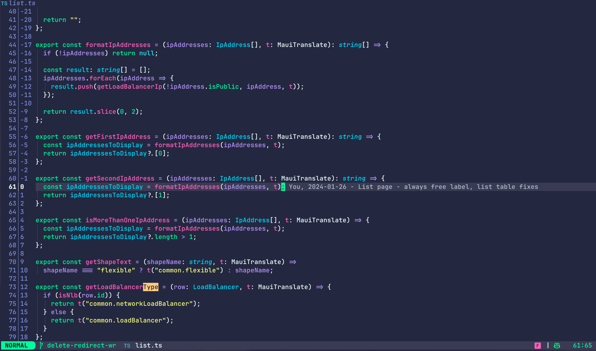
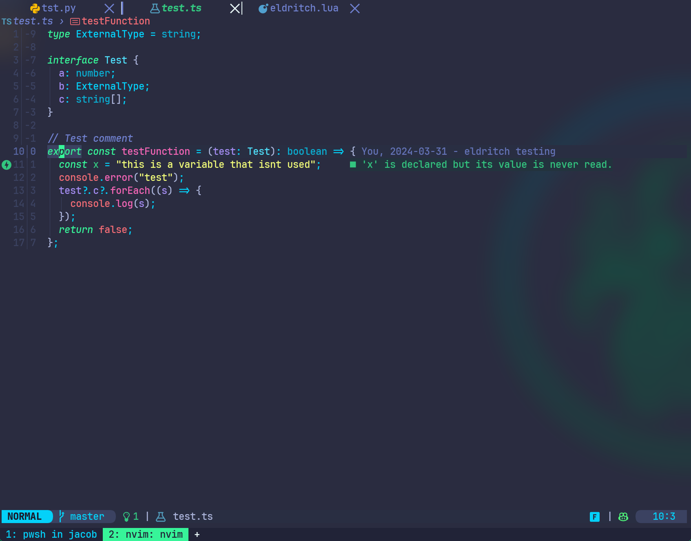
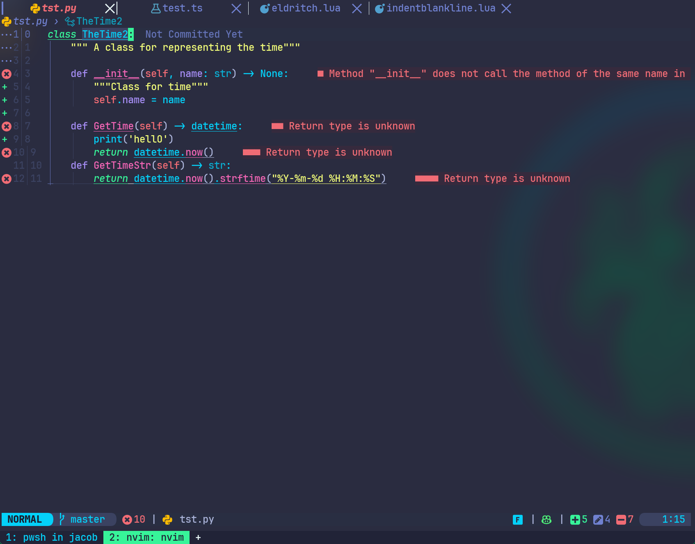
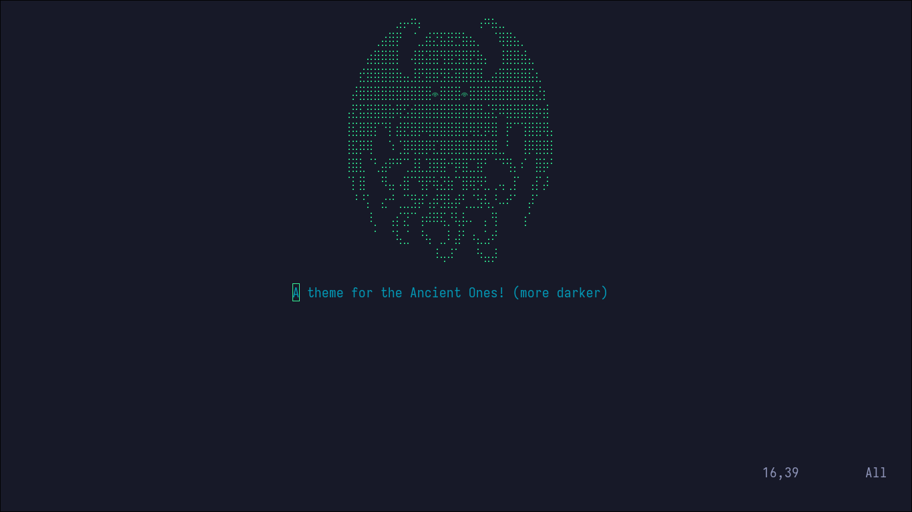
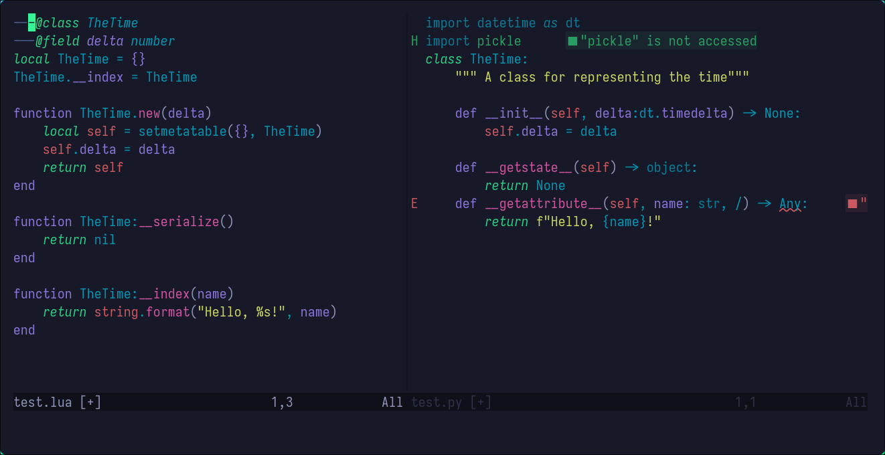
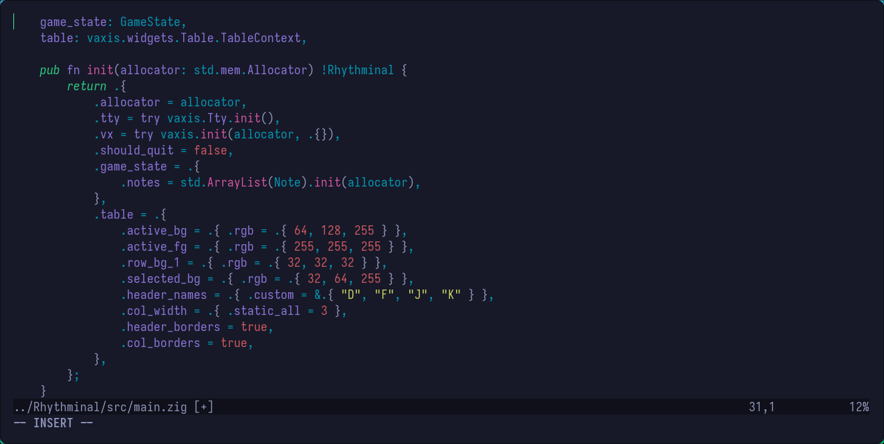
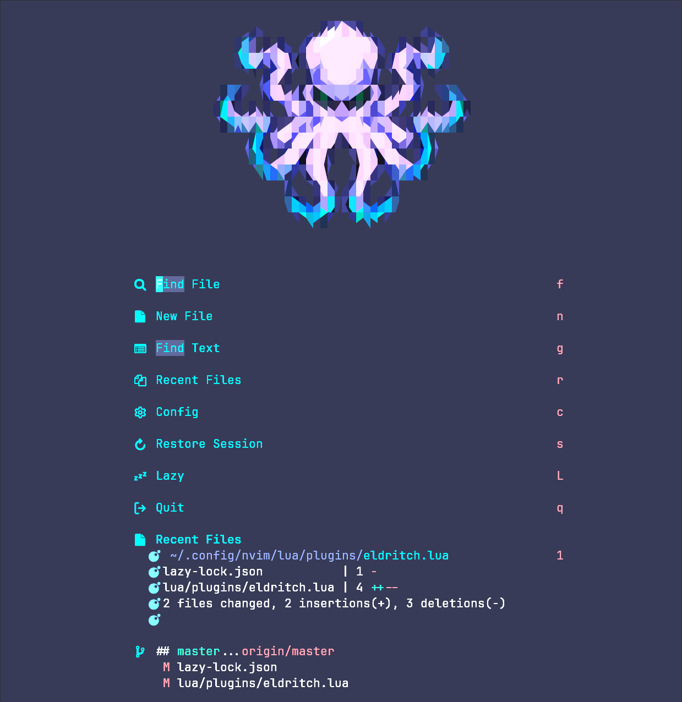
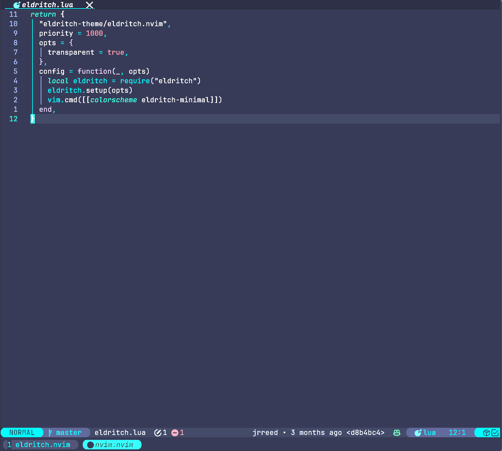
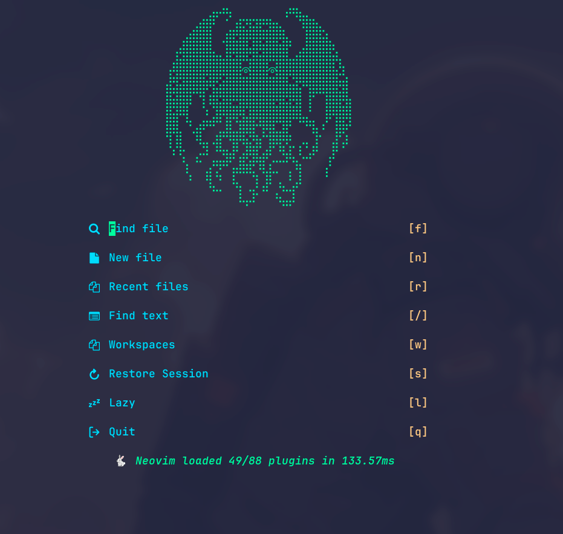

<p align="center">

</p>
<p>
Eldritch is a community-driven dark theme inspired by Lovecraftian horror. With tones from the dark abyss and an emphasis on green and blue, it caters to those who appreciate the darker side of life.
</p>

Main Theme repo can be found [here](https://github.com/eldritch-theme/eldritch)

### Showcase

<figure>
<figcaption>Transparent disabled (default)</figcaption>
<br/>
</figure>
<figure>
<figcaption>Transparent enabled</figcaption>
<br/>
</figure>
<figure>
<figcaption>Python (basepyright) Example</figcaption>
<br/>
</figure>

<details><summary><b>🌃 Darker palette screenshots</b></summary>

| Dashboard | Python and Lua Highlights | Zig Highlights |
|:-:|:-:|:-:|
|  |  |  |

</details>

<details><summary><b>🌃 Minimal palette screenshots</b></summary>

| Dashboard | Code Screenshot |
|:-:|:-:|
|  |  |

</details>

### Installation

Using [lazy.nvim](https://github.com/folke/lazy.nvim):

```lua
{
  "eldritch-theme/eldritch.nvim",
  lazy = false,
  priority = 1000,
  opts = {},
}
```

### Usage

#### Lua

```lua
vim.cmd[[colorscheme eldritch]]
```

#### [Lualine](https://github.com/nvim-lualine/lualine.nvim)

```lua
-- Lua
require('lualine').setup {
  options = {
    -- ... your lualine config
    theme = 'eldritch'
    -- ... your lualine config
  }
}
```

#### fzf-lua

If you want transparent background for all of fzf-lua you need to pass the following into your opts or setup of fzf-lua:

```
    fzf_colors = {
      true,
      bg = "-1",
      gutter = "-1",
    },

```

### Configuration

[Eldritch](https://github.com/eldritch-theme/eldritch.nvim) uses the default options, unless `setup` is explicitly called.

```lua
require("eldritch").setup({
  -- your configuration comes here
  -- or leave it empty to use the default settings
  -- palette = "default", -- This option is deprecated. Use `vim.cmd[[colorscheme eldritch-dark]]` or `vim.cmd[[colorscheme eldritch-minimal]] instead.
  transparent = false, -- Enable this to disable setting the background color
  terminal_colors = true, -- Configure the colors used when opening a `:terminal` in [Neovim](https://github.com/neovim/neovim)
  styles = {
    -- Style to be applied to different syntax groups
    -- Value is any valid attr-list value for `:help nvim_set_hl`
    comments = { italic = true },
    keywords = { italic = true },
    functions = {},
    variables = {},
    -- Background styles. Can be "dark", "transparent" or "normal"
    sidebars = "dark", -- style for sidebars, see below
    floats = "dark", -- style for floating windows
  },
  sidebars = { "qf", "help" }, -- Set a darker background on sidebar-like windows. For example: `["qf", "vista_kind", "terminal", "packer"]`
  hide_inactive_statusline = false, -- Enabling this option, will hide inactive statuslines and replace them with a thin border instead. Should work with the standard **StatusLine** and **LuaLine**.
  dim_inactive = false, -- dims inactive windows, transparent must be false for this to work
  lualine_bold = true, -- When `true`, section headers in the lualine theme will be bold

  --- You can override specific color groups to use other groups or a hex color
  --- function will be called with a ColorScheme table
  ---@param colors ColorScheme
  on_colors = function(colors) end,

  --- You can override specific highlights to use other groups or a hex color
  --- function will be called with a Highlights and ColorScheme table
  ---@param highlights Highlights
  ---@param colors ColorScheme
  on_highlights = function(highlights, colors) end,
})
```

### 🪓 Overriding Colors & Highlight Groups

How the highlight groups are calculated:

1. `colors` are determined based on your configuration, with the ability to
   override them using `config.on_colors(colors)`.
1. These `colors` are utilized to generate the highlight groups.
1. `config.on_highlights(highlights, colors)` can be used to override highlight
   groups.

### Settings and color alteration demonstration

```lua
require("eldritch").setup({
  -- disable italic for functions
  styles = {
    functions = {}
  },
  sidebars = { "qf", "vista_kind", "terminal", "packer" },
  -- Change the "hint" color to the "orange" color, and make the "error" color bright red
  on_colors = function(colors)
    colors.hint = colors.orange
    colors.error = "#ff0000"
  end
})
```

#### Extras

##### [dashboard.nvim](https://github.com/nvimdev/dashboard-nvim) banner

<br/>

If you want the header for dashboard.nvim inside your dashboard lua config:

```lua
    local logo = [[
⠀⠀⠀⠀⠀⠀⠀⣠⡤⠶⡄⠀⠀⠀⠀⠀⠀⠀⢠⠶⣦⣀⠀⠀⠀⠀⠀⠀⠀
⠀⠀⠀⠀⢀⣴⣿⡟⠀⠈⣀⣾⣝⣯⣿⣛⣷⣦⡀⠀⠈⢿⣿⣦⡀⠀⠀⠀⠀
⠀⠀⠀⣴⣿⣿⣿⡇⠀⢼⣿⣽⣿⢻⣿⣻⣿⣟⣷⡄⠀⢸⣿⣿⣾⣄⠀⠀⠀
⠀⠀⣞⣿⣿⣿⣿⣷⣤⣸⣟⣿⣿⣻⣯⣿⣿⣿⣿⣀⣴⣿⣿⣿⣿⣯⣆⠀⠀
⠀⡼⣿⣿⣿⣿⣿⣿⣿⣿⣿⣿⣿⣿⣿⣿⣿⣿⣿⣿⣿⣿⣿⣿⣜⡆⠀
⢠⣟⣯⣿⣿⣿⣷⢿⣫⣾⣿⣿⣿⣿⣿⣿⣿⣿⣿⣬⣟⠿⣿⣿⣿⣿⡷⣾⠀
⢸⣯⣿⣿⡏⠙⡇⣾⣟⣿⡿⢿⣿⣿⣿⣿⣿⢿⣟⡿⣿⠀⡟⠉⢹⣿⣿⢿⡄
⢸⣯⡿⢿⠀⠀⠱⢈⣿⢿⣿⡿⣏⣿⣿⣿⣿⣿⣿⣿⣿⣀⠃⠀⢸⡿⣿⣿⡇
⢸⣿⣇⠈⢃⣴⠟⠛⢉⣸⣇⣹⣿⣿⠚⡿⣿⣉⣿⠃⠈⠙⢻⡄⠎⠀⣿⡷⠃
⠈⡇⣿⠀⠀⠻⣤⠠⣿⠉⢻⡟⢷⣝⣷⠉⣿⢿⡻⣃⢀⢤⢀⡏⠀⢠⡏⡼⠀
⠀⠘⠘⡅⠀⣔⠚⢀⣉⣻⡾⢡⡾⣻⣧⡾⢃⣈⣳⢧⡘⠤⠞⠁⠀⡼⠁⠀⠀
⠀⠀⠀⠸⡀⠀⢠⡎⣝⠉⢰⠾⠿⢯⡘⢧⡧⠄⠀⡄⢻⠀⠀⠀⢰⠁⠀⠀⠀
⠀⠀⠀⠀⠁⠀⠈⢧⣈⠀⠘⢦⠀⣀⠇⣼⠃⠰⣄⣡⠞⠀⠀⠀⠀⠀⠀⠀⠀
⠀⠀⠀⠀⠀⠀⠀⠀⠀⠸⢤⠼⠁⠀⠀⠳⣤⡼⠀⠀⠀⠀⠀⠀
    ]]
    logo = string.rep("\n", 2) .. logo
    local opts = {
      config = {
        header = vim.split(logo, "\n"),
    ...
    }
```

#### Special Thanks

- To [@folke](https://github.com/folke/tokyonight.nvim) for his tokyonight theme. I used his repo as a template to create this theme. I cloned his repo and replaced the colors with mine as well as some minor tweaks.
